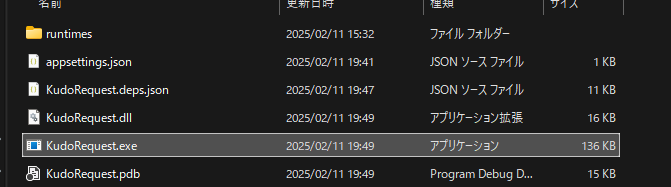

# 概要
このコンソールアプリは、Azure WebJob を選択して起動し、実行パラメータを付与してリクエストするツール です。
WebJob の実行に必要な Azure アクセストークンを取得し、ユーザーの選択に基づいて WebJob を実行 します。


# 使い方
## 1. 実行する WebJob のリストを appsettings.json に定義
```json
{
  "KuduSettings": {
    "WebJobs": [
      {
        "Id": 1,
        "Name": "Poc",      //WebJob名
        "WebJobUrl": "url"  //リクエストするURL
      },
      {
        "Id": 2,
        "Name": "Sample",
        "WebJobUrl": "url"
      }
    ]
  }
}

```

## 2. exeファイルを起動してコンソールを立ち上げる
- ファイル内のexeをクリックしてください。  

 

- クリック後コンソールが立ち上がります。


- コンソールの案内に従い実行するWebJobとパラメータを指定してください。

```perl
WebJobへの実行リクエストを開始します。

実行する WebJob を選択してください:
1: Poc
2: Sample

選択（番号）:
>>> 1

選択された WebJob: Poc
実行するパラメータ: arguments=-param1%20value1%20-param2%20value2

このパラメーターで実行しますか？ (yes/no)
>>> yes

リクエストするURLに問題ないか確認してください。
https://test-dev-cte5buanb4gvg5hw.scm.azurewebsites.net/api/triggeredwebjobs/Webjob.Poc/run?arguments=-param1%20value1%20-param2%20value2

この内容で WebJob を実行しますか？ (yes/no)
>>> yes

WebJob 実行リクエストに成功しました。
AzurePortal上で実行ログを確認してください。
（この機能は実行のリクエストを行うだけで、WebJobの処理が成功したわけではありません。）

処理が完了しました。終了するには `end` と入力してください...
>>> end

```